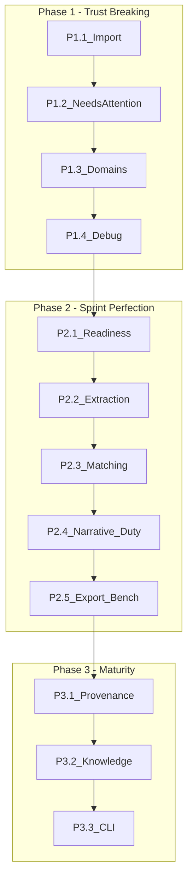

# NECO A-H Perfection Plan (LOCKED)

**Core rule (non-negotiable):** NECO must never appear more certain than its evidence.

---

## Phase 1 — Trust-breaking fixes (no parallel work)

### P1.1 Additive + idempotent import

**File:** `[backend/app/services/shipment_analysis_service.py](backend/app/services/shipment_analysis_service.py)` `_import_line_items_from_documents` (lines 1436-1554)

**Problem:** `if shipment.items: return` — one existing item blocks all further imports.

**Changes:**

- Remove the early-return guard.
- Match existing items by: (1) line_number, (2) `md5(label.strip().lower())[:12]` description hash, (3) declared_hts + COO as tiebreaker.
- **Merge rules (deterministic, no silent overwrite):**
  - Identical on all fields -> **skip**
  - Existing empty, incoming filled -> **merge** (update in place)
  - Both have HTS with different values -> **conflict** (do not overwrite)
  - No match -> **add**
- **Conflict objects** stored in summary:

```python
{
  "imported": 8, "merged": 2, "skipped": 1,
  "conflicts": [
    {"existing": "...", "incoming": "...", "reason": "line_number collision, different HTS"}
  ]
}
```

- Return summary dict (change return type from `None` to `Dict[str, Any]`).
- Store in `result_json["import_summary"]`.
- **UI must show result** — not just stored. Display: "Import results: 8 added, 2 merged, 1 conflict" with expandable conflict details.

**Acceptance:** No early return; no silent overwrite; all outcomes visible; deterministic merging.

---

### P1.2 Needs Attention + visibility fix

**File:** `[frontend/src/components/shipment-tabs/analysis-tab.tsx](frontend/src/components/shipment-tabs/analysis-tab.tsx)`

**Problem:** `visibleRows` filter (line ~1273) hides `no_classification` / `needs_input` / `insufficient_support` in entry-compliance mode.

**Changes:**

**a) Fix filter:**

```typescript
const ALWAYS_VISIBLE_LEVELS = ["no_classification", "needs_input", "insufficient_support"]
const visibleRows = isPreCompliance
  ? viewItems
  : viewItems.filter((i: any) =>
      i.recommendedHts || i.estimatedSavings > 0 ||
      ALWAYS_VISIBLE_LEVELS.includes(i.classificationMemo?.support_level))
```

**b) Needs Attention section — ABOVE EVERYTHING (first thing after sticky header):**

- Placement: after sticky header (~line 1315), before narrative header card, before regulatory flags, before table.
- Compute `attentionItems` from `viewItems` where `support_level` in `ALWAYS_VISIBLE_LEVELS`.
- Skip section entirely if `attentionItems.length === 0`.
- Heading: "Needs Attention (N)" + subtitle.
- Card types with mandatory CTAs:
  - `**needs_input`**: show required questions; CTA "Answer & re-run" -> `onReRunWithClarifications`
  - `**no_classification**`: show reason; CTA "Upload evidence" / "Map documents" -> `onSwitchToDocuments`
  - `**insufficient_support**`: show warning; CTA "Review evidence" -> opens drawer

**c) Blocked items appear in BOTH places (Option B):**

- Primary: Needs Attention card with CTA (action point).
- Secondary: table row with existing collapsed/dimmed treatment (reference — nothing disappears).

**Acceptance:** 100% of blocked items visible; no empty tables when issues exist; user can act immediately; Needs Attention is the first thing seen.

---

### P1.3 Three-domain UI separation

**File:** `[frontend/src/components/shipment-tabs/analysis-tab.tsx](frontend/src/components/shipment-tabs/analysis-tab.tsx)` (lines ~1425-1684)

**Problem:** One blended table mixes classification, duty, and regulatory. Users read it as a single verdict.

**Changes — three separate Card components (must feel like 3 different systems, not 3 sections of one table):**

**Card 1: Classification (always shown)**

- Columns: Item, Declared HTS, Suggested HTS, Evidence Strength, Summary, Evidence Used, Actions.
- Collapsed-row treatment for `no_classification` / `needs_input` (from D.1).
- **Disclaimer footer:** "Classification suggestions are not legal determinations. Confirm with your broker before filing."

**Card 2: Duty Scenarios**

- **Section-level gate:** only render if `viewItems.some(vi => vi.classificationMemo?.support_level === "supported" && (vi.duty || vi.dutyScenarios))`.
- If no items qualify: **hide entire section** (not a section full of "unavailable" messages).
- Columns: Item, Declared HTS, Declared Rate, Suggested HTS, Suggested Rate, Difference, COO, Basis.
- **Disclaimer footer:** "Duty estimates are MFN base-rate approximations. Preferential programs, Chapter 99, and FTA treatment are not modeled."

**Card 3: Regulatory / PSC Signals**

- **Section-level gate:** only render if any items have `regulatory` entries, `psc` data, or `regulatoryFlags`.
- Existing regulatory flags block becomes header of this section.
- Compact flagged-item list: name + flag type + signal summary.
- **Disclaimer footer:** "Regulatory signals are informational only. They do not constitute legal compliance determinations."

Each card: own border, header, disclaimer. `RecommendationDetailDrawer` opens from any section.

**Acceptance:** No blended interpretation; duty never appears on weak classification; regulatory never reads as authoritative.

---

### P1.4 Remove debug logging

**Files:**

- `[backend/app/services/shipment_analysis_service.py](backend/app/services/shipment_analysis_service.py)`: 4 blocks (~535, ~550, ~567, ~1250)
- `[backend/app/services/analysis_orchestration_service.py](backend/app/services/analysis_orchestration_service.py)`: 1 block (~307)

**Changes:** Delete all `#region agent log` / `#endregion` blocks and their contents.

**Verification:** Run `grep -r "agent log" backend/`, `grep -r "write(" backend/` (check for file writes), `grep -r "/tmp" backend/`.

**Acceptance:** Zero hard-coded file writes; CI safe; production safe.

---

## Phase 2 — Perfect each sprint (no new features)

### P2.1 Readiness strip (Sprint A)

- Extend trust-workflow API: `classification_ready`, `duty_ready`, `regulatory_ready` (backend-derived only, no client inference).
- Compact strip: Documents (N/M usable), Items (N/M ready), Classification (ready/not), Duty (not ready).
- Replace "Complete" with "Analysis generated", "Eligible" with "Ready for classification."

### P2.2 Extraction depth (Sprint B)

- Structured extraction: `product_name`, `mpn`, `key_phrases` in `structured_data` JSONB.
- Reprocess button on documents tab.
- **Early warning on docs tab** when extraction is weak (not only during analysis).

### P2.3 Matching quality (Sprint C)

- `match_confidence` on every `evidence_used` entry: `"high"` (item_doc_link), `"medium"` (semantic), `"low"` (filename/all_docs).
- Filename match ALWAYS lowest confidence.
- Visible tier label: "Match: LOW (filename only)."

### P2.4 Narrative + duty + review (D/E/F)

- **D:** `classification_outcome` API field; all UI copy from `support_level` only — no independent strings.
- **E:** Override audit on every path; shipment status derived from item decisions only — no second state system.
- **F:** `_get_hts_if_supported` allows **only `"supported"`** (remove `weak_support`). Basis block on every duty display: HTS version, origin, declared vs suggested, exclusions.

### P2.5 Export + benchmark + rules (G/H)

- **G:** `schema_version`, `analysis_provenance`, `blocking_reasons`, per-item `evidence_used` and `open_questions` in exports.
- **H:** Real pipeline benchmark (not just helpers); metrics: accuracy, false confidence, refusal rate. `RULE_REGISTRY` with `rule_id`, `owner`, `rationale`, `test_case_ids`.

---

## Phase 3 — System maturity

### P3.1 Provenance everywhere

Every export includes `analysis_provenance` from `Analysis.result_json`. Answers: "why is this different from last week?"

### P3.2 Product knowledge layer (optional, high value)

Store accepted HTS + evidence + overrides per product description hash. Surface "Previously accepted" on new analysis.

### P3.3 Benchmark CLI

`backend/scripts/run_benchmark.py`: load gold set, run pipeline, compute metrics, print report.

---

## Deferred (do not touch)

- Compliance signal engine
- Bulk import UX expansion
- Section 301 overlays
- Advanced preferences

---

## Execution order (locked)

**Phase 1 (sequential, no parallel):** P1.1 -> P1.2 -> P1.3 -> P1.4

**Phase 2 (sequential):** P2.1 -> P2.2 -> P2.3 -> P2.4 -> P2.5

**Phase 3 (sequential):** P3.1 -> P3.2 -> P3.3




