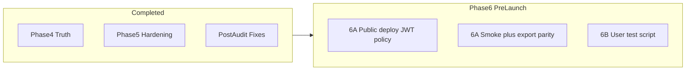

# Pre-user testing: where we landed

## Do we agree you are in the right place?

**Yes.** The arc is coherent:

| Era                                    | What it fixed                                                                                                                                                                                                                                                                                                                                                                                                                                                                                                                                                                                                                   |
| -------------------------------------- | ------------------------------------------------------------------------------------------------------------------------------------------------------------------------------------------------------------------------------------------------------------------------------------------------------------------------------------------------------------------------------------------------------------------------------------------------------------------------------------------------------------------------------------------------------------------------------------------------------------------------------- |
| **Phase 4 (Truth alignment)**          | Single HTS gate for regulatory; `review_snapshot` = canonical `result_json`; knowledge `org_id` from shipment; accept-all persistence; duty UI gating; copy/prior knowledge/readiness wiring; reviews snapshot-first intent; StatusPill; benchmark/S3 parity.                                                                                                                                                                                                                                                                                                                                                                   |
| **Phase 5 (User testing hardening)**   | `snapshot_json` field fix (reviews no longer fell back to live analysis); `PATCH /reviews/{id}` through [`ReviewService.transition_status`](backend/app/services/review_service.py); migration [`015_update_product_hts_map`](backend/alembic/versions/015_update_product_hts_map.py); JWT verify path + config; telemetry/dev panels removed; stale-running + duplicate analyze guards; analyze **500** only for unexpected errors; review detail loading; surfaced silent catches; reviews visibility parity; `run_in_executor` for scraper/pdf/S3; [`ErrorBoundary`](frontend/src/components/ui/error-boundary.tsx) on tabs. |
| **Post-audit hardening (two batches)** | Re-raise [`HTTPException`](backend/app/api/v1/shipments.py) on `/analyze`; JWT startup guard in [`config.py`](backend/app/core/config.py); async JWKS; clear `reviewDetail` on load; strip `dev_context` outside dev/local; optional `CLERK_JWT_AUDIENCE`; logging/copy/migration/CSV polish.                                                                                                                                                                                                                                                                                                                        |

**Net:** Cross-surface truth (analysis / review / export / knowledge) is aligned enough that real users will surface *behavior* and *expectation* issues, not silent dual-truth failures at the scale you had before.

**Phase 6A (implemented in repo):** Non-local `ENVIRONMENT` values require `CLERK_JWT_VERIFY=true` and `CLERK_JWKS_URL`. See [`docs/DEPLOYMENT.md`](docs/DEPLOYMENT.md).

---

## Phase 6 — Pre-Launch Verification & User Test Operations (no feature work)

This is **not** “the system is done.” It means: **deployment-safe**, **ready to learn**, **no more pre-user feature work**.

Treat Phase 6 as **two workstreams**: (A) enforced deploy policy + trust smoke verification, (B) how you run user sessions.

### Phase 6A — Deploy policy, env docs, and smoke verification (mandatory)

#### 1. Policy (non-optional): externally reachable = JWT verification required

**Do not rely on people remembering which `ENVIRONMENT` string implies security.**

- **Policy:** Any environment that is reachable from outside the developer’s machine (staging, demo, prod, shared QA, etc.) **must** run with verified JWTs (`CLERK_JWT_VERIFY=true` + `CLERK_JWKS_URL`, plus issuer/audience as you standardize).
- **Enforcement (shipped):** Only `development`, `dev`, and `local` are exempt. All other `ENVIRONMENT` values require JWT verification at startup.

Document: [`docs/DEPLOYMENT.md`](docs/DEPLOYMENT.md), [`backend/.env.example`](backend/.env.example).

#### 2. Environment checklist (minimal doc)

Deployment secrets / runbook: `CLERK_JWKS_URL`, `CLERK_JWT_VERIFY=true`, `CLERK_JWT_ISSUER`, and `CLERK_JWT_AUDIENCE` when using multi-app Clerk.

#### 3. Trust-focused smoke pass (manual or scripted)

Checklist: [`docs/USER_TESTING_PHASE6.md`](docs/USER_TESTING_PHASE6.md) section **6A**.

### Phase 6B — User testing operations (process, not code)

Script and observation template: [`docs/USER_TESTING_PHASE6.md`](docs/USER_TESTING_PHASE6.md) section **6B**.

**Stop rule:** On any **P0 trust break** (snapshot vs export mismatch, accept not persisting, auth bypass), **stop sessions** and fix before more feedback.

---

## What we are *not* doing before users

- New classification work, broader benchmark pushes, or compliance logic expansion.
- UI polish beyond obvious test blockers.
- Perfect migration downgrade semantics (ops concern).
- JWT `aud` until you need it (set `CLERK_JWT_AUDIENCE` when you do).

---

## Verdict

**Right next step:** Non-local deploys are **auth-safe by enforced policy**; run the **smoke checklist** in `docs/USER_TESTING_PHASE6.md`, then **observed user sessions**.

Single-sentence summary: *deployment-safe, verify trust surfaces once, then learn from real users—not more pre-user building.*
