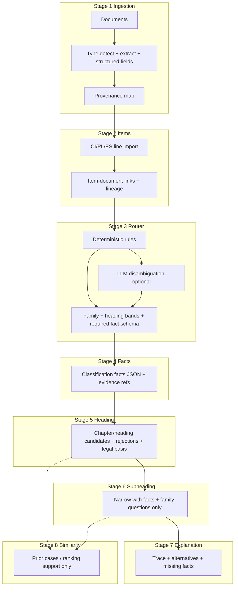

# Classification & customs reasoning — diagnosis, target architecture, and phased plan

This document responds to the systems-design request: **fix how NECO reasons about classification**, not one shipment’s HTS code. It is grounded in the current codebase (as of the authoring date) and avoids shipment-specific hardcoding.

---

## Part 1 — Root-cause analysis of the current implementation

### 1.1 Vector / similarity as primary retrieval (confirmed)

| Location | What it does today | Why it is wrong vs target | What should replace it |
|----------|-------------------|---------------------------|-------------------------|
| [`backend/app/engines/classification/engine.py`](backend/app/engines/classification/engine.py) `_generate_candidates` | Uses PostgreSQL **`pg_trgm` `similarity()`** on `tariff_text_short` vs product description; **`ORDER BY similarity(...) DESC LIMIT 50`**. This is the main candidate discovery path when heading gating does not short-circuit. | Tariff text similarity is **retrieval**, not legal classification. It conflates “lexically close” with “correct heading/subheading.” | **Stage 3–5**: deterministic family/chapter routing → heading candidates from **rules + structured facts** → similarity only to **rank/support** alternatives already justified. |
| Same file, scoring | `similarity_score` feeds composite score (~80% weight in `_score_candidate`). | Same issue: numeric blend hides whether a candidate is legally plausible. | Score = **legal fit** (facts vs heading notes) + **supporting** lexical match, with explicit separation in the result object. |
| [`backend/app/engines/classification/status_model.py`](backend/app/engines/classification/status_model.py) | `determine_status` uses **`best_similarity`** thresholds (**0.18**, **0.25**) to choose `NO_CONFIDENT_MATCH`, `REVIEW_REQUIRED`, `SUCCESS`. | **Status is driven by similarity**, not by “heading resolved + facts complete + rules applied.” | Status from **explanation trace**: e.g. `HEADING_UNRESOLVED`, `FACTS_MISSING`, `LEGAL_AMBIGUITY`, `READY_FOR_SUBHEADING`, plus optional **similarity** as advisory only. |
| [`backend/app/engines/classification/review_explanation.py`](backend/app/engines/classification/review_explanation.py) | Narrative tied to similarity bands. | User-facing explanation anchored to **similarity**, not to GRI / chapter notes. | Explanations cite **facts, rejected headings, legal criteria**; similarity mentioned only as “supporting lexical overlap.” |

**Conclusion:** The pipeline **does** treat lexical similarity (pg_trgm) as the **primary** way to get candidates and **gates** success/review on similarity scores. That matches the critique.

---

### 1.2 Product ontology / clarification paths

| Location | What it does today | Why it is wrong | What should replace it |
|----------|-------------------|-----------------|-------------------------|
| [`backend/app/engines/classification/required_attributes.py`](backend/app/engines/classification/required_attributes.py) | `ProductFamily` enum (~13 values). **`identify_product_family(description, extracted_attributes)`** uses **keyword heuristics** (e.g. bottle, router, cotton). | Coarse families; easy to mis-route (e.g. server vs “electronics”); **no** separation of ADP vs networking vs storage vs instruments as **first-class** routes. | Expand **router taxonomy** (see Part 2); **deterministic** rules + LLM **only** to disambiguate when rules tie. |
| Same + [`product_analysis.py`](backend/app/engines/classification/product_analysis.py) | Per-family **required_attributes**; missing attrs → **`CLARIFICATION_REQUIRED`** **before** candidate retrieval (`engine.py` short-circuit). | Questions are **family-scoped in data**, but **family inference is brittle**; **CONTAINERS** / **FOOD_CONTAINERS** / **housing_material** can fire for wrong families if keywords overlap or family is wrong. | **Family-specific question sets** loaded only **after** router + heading band is stable; **no** shared attribute list across unrelated families. |
| [`attribute_maps.py`](backend/app/engines/classification/attribute_maps.py) | Maps a few families to chapters / rationale lists. | Partial; not a full **legal** ontology. | Becomes **clarification templates** keyed by `(product_family, heading_band)`. |

---

### 1.3 Document → item model

| Location | What it does today | Why it is wrong | What should replace it |
|----------|-------------------|-----------------|-------------------------|
| [`backend/app/services/shipment_analysis_service.py`](backend/app/services/shipment_analysis_service.py) `_import_line_items_from_documents` | Reads **`structured_data.line_items`** from ES/CI docs; merges into `ShipmentItem`. Runs **during analysis**, not on upload. | Items can exist without **provenance** links to source rows. | **Stage 2**: import + **`item_line_provenance`** (doc id, row index, cell refs); **auto-link** CI doc to items created from that doc (see below). |
| [`backend/app/api/v1/shipments.py`](backend/app/api/v1/shipments.py) `create_item_document_link` | **`ShipmentItemDocument`** rows created **only** via explicit API (and user “Link” in UI). | No automatic link from parsed CI → imported lines. | On successful import from doc D, **`AUTO`** link every `ShipmentItem` whose provenance references D. |
| Grep: `ShipmentItemDocument(` | Only model definition + API create. | Confirms **no** pipeline auto-insert of links. | Post-import hook + ambiguity detection. |

---

### 1.4 Structured “classification facts” layer

| Current state | Gap |
|---------------|-----|
| `ProductAnalyzer` / `serialize_analysis` in [`product_analysis.py`](backend/app/engines/classification/product_analysis.py) | Produces analysis blobs and missing attrs; **not** a stable, persisted **facts** schema with evidence pointers. |
| `result_json` in analysis pipeline | Rich but **engine-centric**; not a normalized **facts + trace** contract for UI, chat, or audit. |

**Needed:** Persisted **`classification_facts`** (JSON schema versioned) + **`explanation_trace`** + **`evidence_spans`** per item.

---

### 1.5 Questions “too early / generic”

| Mechanism | Effect |
|-----------|--------|
| `CLARIFICATION_REQUIRED` returns **before** `_generate_candidates` when `missing_required_attributes` is non-empty (`engine.py`). | Correct **order** in principle (facts before codes), but **missing attrs** come from **heuristic family** + **generic** attribute lists → irrelevant questions if family is wrong. |
| Similarity path still dominates **which** codes appear once attrs are filled. | User sees irrelevant questions **and** weak code quality. |

---

### 1.6 Explanation layer

| Location | Limitation |
|----------|------------|
| `review_explanation.py`, metadata in `engine.py` | Similarity bands, attribute lists; **not** structured “candidates considered / rejected / legal basis.” |
| UI Analysis tab | Renders `result_json`; no dedicated **trace** model. |

---

### 1.7 Salvageable pieces (reuse, don’t worship)

- **Eligibility / document-type** helpers in `shipment_analysis_service` (`_determine_eligibility_path`).
- **RuleBasedClassifier** in [`shipment_analysis_service.py`](backend/app/services/shipment_analysis_service.py) — **expand** as deterministic pre-router.
- **Subheading priors** / `attribute_maps` — migrate into **family + heading** scoped config.
- **Context builder** — keep for **legal text** attached to candidates; decouple from similarity ordering.
- **Import pipeline** — extend with **provenance + auto-link**, don’t rip out.

---

### 1.8 Brittle or one-off patterns (explicit)

| Area | Risk |
|------|------|
| `identify_product_family` keyword lists | Single-word overlaps → wrong family. |
| Audio / 8518 special cases in `engine.py` / `subheading_priors.py` | **Family-specific** logic exists but **not** generalized as a **router + facts** pattern. |
| Similarity thresholds 0.18 / 0.25 | **Global** constants for all products — inappropriate for legal reasoning. |
| `SPRINT12_FAST_ANALYSIS_DEV` etc. | Dev shortcuts that can **mask** pipeline gaps. |

---

## Part 2 — Target architecture (multi-stage)



**Principles:** deterministic routing before LLM elaboration; **facts** before 10-digit prediction; similarity **never** overrides heading logic; **explanation trace** always.

---

## Part 3 — Data model changes (proposed)

| Artifact | Purpose |
|----------|---------|
| **`document_extractions`** (or extend `shipment_documents`) | Normalized type, structured fields, extraction version, provenance. |
| **`shipment_item_line_provenance`** | `item_id`, `document_id`, `source_kind` (row/cell/sheet), `ref` JSON, raw snapshot hash. |
| **`item_document_links`** (existing `shipment_item_documents`) | Add **`provenance_rule`**: `AUTO_FROM_CI`, `AUTO_FROM_DATASHEET`, `USER_CONFIRMED`, `AMBIGUITY_HOLD`. |
| **`classification_facts`** | `item_id`, `facts_json` (schema version), `router_output`, `missing_fact_keys`, updated_at. |
| **`classification_runs` / extend `analyses`** | `heading_trace`, `subheading_trace`, `facts_version`, `explanation_version`. |
| **`clarification_templates`** | `(product_family, heading_band)` → allowed questions + legal rationale id. |
| **`explanation_traces`** | Structured alternatives considered/rejected; optional normalized table for analytics. |

Alembic migrations per phase; **nullable** rollout to avoid big-bang.

---

## Part 4 — Phased refactor plan

### Phase 1 — Worst UX failures (short term)

| Work | Code / UI | Tests | Risk |
|------|-------------|-------|------|
| Auto-link CI lines to items when import provenance ties item to that doc | `shipment_analysis_service` post-import; optional backfill job | Integration: import → link count | Low if gated on provenance |
| Stop treating “no analysis yet” as hard error | Already improved in documents tab; extend to any consumer of `analysis-status` | E2E load shipment | Low |
| Surface extraction/import summary in UI | Documents tab | Snapshot tests | Low |

### Phase 2 — Ontology / router

| Work | Areas | Tests |
|------|--------|-------|
| Expand `ProductFamily` or replace with **`RoutingClass`** taxonomy** | `required_attributes`, new `router/` module | Unit: routing table |
| Deterministic rules first (keywords + structured fields from facts draft) | New module + config YAML/DB | Golden: 4 example shipments **family only** |
| LLM only for tie-break, with schema output | Service + prompt version | Eval harness |

### Phase 3 — Classification facts layer

| Work | Areas | Tests |
|------|--------|-------|
| JSON schema + persistence | New table + Pydantic models | Contract tests |
| Extractors: map `ProductAnalyzer` + doc fields → facts | Pipeline step before `generate_alternatives` | Round-trip |
| Evidence pointers | Doc storage + offsets | Provenance completeness metric |

### Phase 4 — Heading / subheading reasoning + explanation

| Work | Areas | Tests |
|------|--------|-------|
| Heading candidate builder **not** `ORDER BY similarity` first | Refactor `_generate_candidates` into **retrieve legal candidates** + **score by facts** | Compare traces |
| Replace status thresholds with **trace-based** status | `status_model.py` | Unit |
| Explanation object mandatory on every candidate path | `engine.py` / new `explanation_builder.py` | Golden outputs |

### Phase 5 — Chat bar

| Work | Areas | Tests |
|------|--------|-------|
| RAG **only** on structured trace + facts + doc snippets | New API `POST /classification/explain-query` | No hallucination: cite-or-refuse |
| UI bar on Analysis | Frontend | Manual + Playwright |

### Phase 6 — Quality harness

| Work | Metrics (below) | CI |
|------|-----------------|-----|
| Example-driven suite | Four shipment archetypes + fixtures | Gate on family + trace fields, not single HTS |

---

## Part 5 — Pseudo-code (router + facts)

### Router (deterministic first)

```python
def route_product(facts_draft: dict, doc_signals: list[dict]) -> RouterResult:
    # 1) Hard rules from structured extraction (NECO internal)
    if facts_draft.get("chapter_84_adp_signals"):
        return RouterResult(primary_family="ADP_MACHINES", confidence=0.85, rationale="explicit_adp_markers")
    if facts_draft.get("pressure_sensing_explicit") and facts_draft.get("industrial_instrument"):
        return RouterResult(primary_family="MEASURING_INSTRUMENTS", ...)

    # 2) Keyword / table only as weak signals — never sole basis for final HTS
    weak = score_keyword_families(facts_draft["commercial_description"])
    # 3) LLM only if rules tie — constrained JSON schema
    if needs_disambiguation(weak):
        return llm_router_disambiguate(facts_draft, allowed_families=ROUTER_ENUM)
    return weak.best()
```

### Facts layer (merge)

```python
def build_classification_facts(item: ShipmentItem, docs: list[Document], prior: dict | None) -> ClassificationFacts:
    base = extract_from_invoice_and_datasheets(item, docs)  # deterministic + LLM assist with citations
    base["supporting_evidence"] = collect_evidence_spans(base, docs)
    base["missing_classification_facts"] = diff_required(base, router_output.required_fact_keys)
    return ClassificationFacts(version=1, payload=base)
```

---

## Part 6 — Evaluation plan (metrics)

| Metric | How to measure |
|--------|----------------|
| Correct **product-family routing** | Gold labels on example set; **not** HTS match |
| Correct **heading candidate** set (top-k contains true heading) | Legal eval set |
| **Clarification relevance** | Human rubric 1–5; irrelevant-question **rate** |
| **CI auto-link success** | % items with `AUTO_FROM_CI` where ground truth has CI line |
| **Explanation completeness** | Checklist: facts, headings considered, rejects, missing facts |
| **Provenance completeness** | % facts with doc + location |
| **Manual interventions** | Count per shipment |
| **False-positive irrelevant questions** | Flag questions not in template for `(family, heading_band)` |

---

## Part 7 — Example test suite (four archetypes)

| Archetype | Documents fixture | Assertions (no single HTS hardcoded) |
|-----------|---------------------|--------------------------------------|
| Rack server / ADP | CI + datasheet + PL | `routing_family in {ADP, COMPUTING_UNITS}`; no `food_grade` question; facts include `principal_function`, `complete_machine`; CI auto-linked |
| Plastic bottles | CI + spec + COO | `routing_family` plastics/household; questions include material, capacity, food-contact **only if** template says so |
| Pressure sensor | CI + datasheet + PO + origin | `MEASURING_INSTRUMENTS` or equivalent; no electronics packaging questions |
| Steel fasteners | CI + mill cert + PL + spec | Fastener family; material/thread facts; **no** merge of distinct invoice lines without ambiguity flag |

Implement as **backend pytest** + JSON fixtures (descriptions + structured fields **simulating** extraction — not copying one real shipment’s answer).

---

## Part 8 — UI/UX changes

| Surface | Change |
|---------|--------|
| **Documents** | Show **import provenance** (which doc/row created item); auto-linked CI badge; manual map only if **AMBIGUITY** |
| **Analysis** | **Facts panel** + **heading trace** + **missing legal facts** (not similarity-first copy) |
| **Chat bar (future)** | Questions scoped to **trace + facts**; must cite `explanation_trace` / evidence ids |

---

## Part 9 — Explicit non-goals

- No **shipment-specific** HTS in code paths.
- No **vendor/SKU** shortcuts for classification outcome.
- Similarity remains **support** tier only after this refactor.

---

*This plan is intended to align engineering work with defensible customs automation. Implement in phases; keep each phase independently shippable.*

---

## Appendix — Phase 1 incremental changes (implemented)

Aligned with immediate “leverage” fixes (no shipment-specific HTS hardcoding):

1. **Similarity no longer hard-fails classification** — `determine_status()` in [`status_model.py`](../backend/app/engines/classification/status_model.py) no longer returns `NO_CONFIDENT_MATCH` solely because `best_similarity < 0.18`. When candidates exist, status falls through to **`REVIEW_REQUIRED`**; `NO_CONFIDENT_MATCH` is for **no scored candidates**. Engine copy updated in [`engine.py`](../backend/app/engines/classification/engine.py); low-similarity cases get an explicit ambiguity note for review.
2. **CI / ES line import → AUTO document links** — [`shipment_analysis_service.py`](../backend/app/services/shipment_analysis_service.py) `_auto_link_line_items_to_source_documents()` creates `ShipmentItemDocument` rows with `mapping_status=AUTO` after line import when descriptions match items.
3. **Computing guardrail** — New `ProductFamily.ELECTRONICS_COMPUTING` with keywords (server, GPU, CPU, datacenter, Cray, etc.) evaluated **before** generic “container” routing in [`required_attributes.py`](../backend/app/engines/classification/required_attributes.py); chapter cluster in [`chapter_clusters.py`](../backend/app/engines/classification/chapter_clusters.py); attribute map in [`attribute_maps.py`](../backend/app/engines/classification/attribute_maps.py).

**Not done yet (Phase 2+):** full router, persisted facts layer, heading-first reasoning refactor, chat bar — see main sections above.
