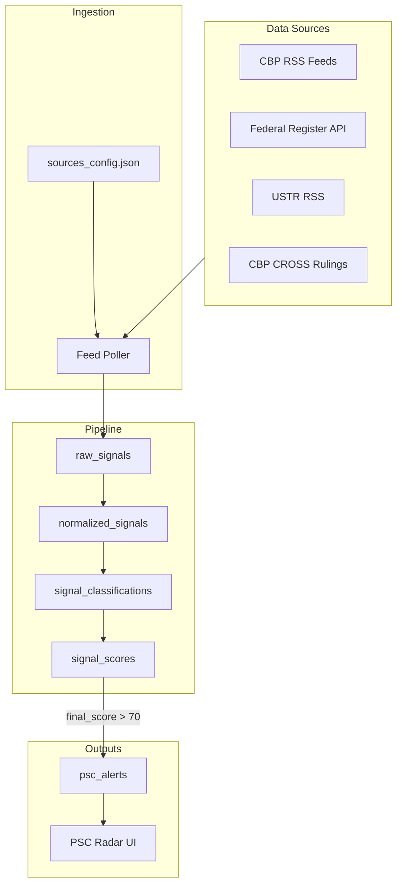

# Regulatory Monitoring

**Purpose:** Data sources, architecture, and implementation notes for NECO's compliance signal ingestion.

**Related:** [docs/COMPLIANCE_SIGNAL_ENGINE.md](COMPLIANCE_SIGNAL_ENGINE.md), [docs/SPRINT17_PLUS_BACKLOG.md](SPRINT17_PLUS_BACKLOG.md)

---

## Data Sources

### Tier 1 (Implement First)

| Source | Type | URL | Relevance | Refresh |
|--------|------|-----|-----------|---------|
| CBP Duty Rate Updates | RSS | https://www.cbp.gov/rss/trade/duty-rates | Duty changes | 6h |
| CBP Trade Updates | RSS | https://www.cbp.gov/rss/trade | General trade | 6h |
| CBP ACE Updates | RSS | https://www.cbp.gov/rss/trade/ace | ACE/entry changes | 5min |
| CBP Trade Legal Decisions | RSS | https://www.cbp.gov/rss/trade/legal-decisions-publications | Rulings | 6h |
| Federal Register | API | https://www.federalregister.gov/api/v1/documents | Rulemakings | 15min |
| USTR News | RSS | https://ustr.gov/archive/Meta_Content/RSS/Section_Index.html | Tariffs, Section 301 | 6h |
| CBP CROSS Rulings | Scrape | https://rulings.cbp.gov/ | Classification rulings | 1h |

**Note:** CBP CSMS (Cargo Systems Messaging Service) does not have a direct RSS feed. Use CBP ACE Updates RSS as proxy, or scrape CSMS Archive at https://www.cbp.gov/document/guidance/csms-archive.

### Tier 2 (Phase 2)

| Source | Type | Relevance |
|--------|------|------------|
| CBP Anti-Dumping/CVD | RSS | https://www.cbp.gov/rss/trade-adcvd |
| CBP Forced Labor | RSS | https://www.cbp.gov/rss/trade/forced-labor | UFLPA |
| OFAC Sanctions | API | Sanctions lists |
| FDA Import Alerts | Scrape/API | Import restrictions |
| USDA Restrictions | Scrape/API | Agricultural imports |

### Tier 3 (Phase 3)

| Source | Type | Relevance |
|--------|------|------------|
| White House Briefing Room | RSS/API | EO, proclamations |
| FreightWaves, JOC | Commercial | Trade news |
| Broker blogs | Scrape | Industry signals |

---

## Architecture



---

## Sources Config

Location: `backend/config/sources_config.json`

```json
{
  "sources": [
    {"name": "CBP_DUTY_RATES", "type": "rss", "url": "https://www.cbp.gov/rss/trade/duty-rates", "frequency": "6h"},
    {"name": "CBP_TRADE", "type": "rss", "url": "https://www.cbp.gov/rss/trade", "frequency": "6h"},
    {"name": "CBP_ACE", "type": "rss", "url": "https://www.cbp.gov/rss/trade/ace", "frequency": "5min"},
    {"name": "FEDERAL_REGISTER", "type": "api", "url": "https://www.federalregister.gov/api/v1/documents", "frequency": "15min"},
    {"name": "CBP_CROSS", "type": "scrape", "url": "https://rulings.cbp.gov/", "frequency": "1h"}
  ]
}
```

---

## Refresh Cadence

| Source Type | Default | Notes |
|-------------|---------|-------|
| RSS (CBP duty, trade) | 6h | Balance freshness vs rate limits |
| RSS (CBP ACE) | 5min | Higher frequency for entry-critical updates |
| Federal Register API | 15min | Rulemakings |
| CBP CROSS | 1h | Rulings; scrape may be rate-limited |

---

## How to Add New Feeds

1. Add entry to `sources_config.json` with `name`, `type`, `url`, `frequency`.
2. Implement fetcher in `RegulatoryFeedPoller` for new `type` if needed (rss, api, scrape).
3. Run migration if schema changes.
4. Update this doc with source URL and relevance.

---

## Implementation Files

| Component | File |
|-----------|------|
| Sources config | `backend/config/sources_config.json` |
| Feed poller | `backend/app/services/regulatory_feed_poller.py` |
| Celery task | `backend/app/tasks/regulatory.py` |
| Celery Beat | `backend/app/core/celery_app.py` |
| Regulatory API | `backend/app/api/v1/regulatory.py` |
