# NECO Sprint Roadmap — Locked

**Purpose:** Canonical sprint map with explicit success criteria and completion gates. Use this to decide when a sprint is done and when to move on.

**Last updated:** February 24, 2026

---

## Sprint Flow

```mermaid
flowchart LR
    subgraph done [Completed]
        S12[Sprint 12 Baseline]
        Fixes[Analysis Pipeline Fixes]
    end

    subgraph ui [UI Sprints]
        S13[Sprint 13 Analysis + Review UI]
        S14[Sprint 14 Upload + Export UI]
    end

    subgraph mvp [MVP Sprints]
        S15[Sprint 15 MVP Hardening]
        S16[Sprint 16 Preferences]
    end

    subgraph post [Post-MVP]
        S17[Sprint 17 Bulk Import]
        S18[Sprint 18 Duty + 301]
        S19[Sprint 19 Signal Engine]
    end

    S12 --> Fixes --> S13
    S13 --> S14 --> S15 --> S16
    S16 --> S17 --> S18 --> S19
    S19 --> S20[Sprint 20 TBD]
```

---

## Sprint 13: UI — Analysis View + Review (MVP Critical Path)

| Field | Value |
|-------|-------|
| **Goal** | Shipment detail shows full analysis with clear states; review flow (accept/reject/override) is real and usable |
| **Scope** | Polish 8 sections (match Sprint 11 language/order), loading/error states, outcome clarity, Review UI (status, Accept/Reject, Override, history) |
| **Success definition** | Create shipment → Upload docs → Analyze → See complete analysis → Review (accept/reject/override) → Status and export gating update |
| **Mark complete when** | (1) All 8 sections render real data when backend provides it; (2) Empty/partial/timeout states have clear copy and Re-run; (3) Sections 1–3 (Outcome, Money Impact, Risk) clearly correct and readable; (4) Review status displayed; Accept/Reject with notes wired; Override flow with audit warning; Review history visible; (5) Manual acceptance |
| **Estimate** | 3–4 days |

---

## Sprint 14: UI — Upload + Export

| Field | Value |
|-------|-------|
| **Goal** | Upload flow solid; export (filing-prep bundle) available from UI with correct gating |
| **Scope** | Upload UX confirmation (multi-file, types, success/error), Export button, REVIEW_REQUIRED gating, Exports tab |
| **Success definition** | Upload ES + CI → Analyze → Export filing-prep bundle from UI; export blocked (or warned) when review required |
| **Mark complete when** | (1) Multi-file upload works with clear success/error; (2) "Download filing-prep" button triggers download; (3) When REVIEW_REQUIRED, export blocked with clear copy and link to Reviews tab; (4) Manual acceptance |
| **Estimate** | 1–2 days |

---

## Sprint 15: MVP Hardening

| Field | Value |
|-------|-------|
| **Goal** | Full path reliable, explainable, ready for limited pilot or stakeholder demo |
| **Scope** | E2E reliability, empty/edge states, language audit, optional UI QA gate + Clerk JWT |
| **Success definition** | Compliance director completes MVP path in under 5 minutes (login → create/upload → analyze → review → export) with no unexplained errors |
| **Mark complete when** | (1) Full path runs without surprises; (2) Every edge state (no shipments, refused, failed, blocked export) has clear copy and next action; (3) Language aligned with Sprint 11 guide (no "AI," "confidence," "recommended"); (4) Optional: UI gate with dev auth; (5) Optional: Clerk JWT validation |
| **Estimate** | 1–2 days |

---

## Sprint 16: User-Selectable Analysis Preferences

| Field | Value |
|-------|-------|
| **Goal** | Users choose what to analyze and at what value thresholds (COO, Duty, HS Code) |
| **Scope** | Backend `analysis_preferences` (psc_threshold, analyze_coo/duty/hs_code, resource_mode); Frontend settings UI |
| **Success definition** | User can set PSC threshold, toggle COO/Duty/HS analysis, choose Light/Standard/Full mode; preferences applied to analysis |
| **Mark complete when** | (1) API GET/PATCH org analysis-preferences; (2) Preferences passed to analysis pipeline; (3) UI for checkboxes and value thresholds; (4) Manual acceptance |
| **Estimate** | 2–3 days |

---

## Sprint 17: Bulk Import

| Field | Value |
|-------|-------|
| **Goal** | User uploads zip; NECO creates one shipment per folder and analyzes all |
| **Scope** | POST /shipments/bulk-import, unzip + group by folder, create shipments + enqueue analyses, frontend drag-drop |
| **Success definition** | Upload zip with shipment_1/, shipment_2/ structure → NECO creates shipments, attaches docs, runs analyses; user sees summary list with links |
| **Mark complete when** | (1) API accepts zip; (2) Grouping by folder works; (3) Shipments created and analyses enqueued; (4) Frontend bulk import UI with progress; (5) Template + guide usable |
| **Estimate** | 2–3 days |

---

## Sprint 18: Duty Rates Accuracy + Section 301 Overlay

| Field | Value |
|-------|-------|
| **Goal** | NECO duty data current; Section 301 (9903) overlay for China-origin goods |
| **Scope** | HTS source doc (done), Section 301 data integration, duty resolution overlay, versioning |
| **Success definition** | When COO=China, Section 301 rates applied; duty resolution combines general + 301; disclaimer in UI |
| **Mark complete when** | (1) Section 301 data integrated; (2) resolve_duty applies overlay when China; (3) HTS version/effective_date documented; (4) UI disclaimer updated |
| **Estimate** | 2–3 days |

---

## Sprint 19: Compliance Signal Engine

| Field | Value |
|-------|-------|
| **Goal** | NECO ingests external signals (CBP, Federal Register, USTR, CROSS), classifies/scores, produces PSC Radar alerts |
| **Scope** | Feed poller, raw_signals → normalized → classified → scored; psc_alerts when final_score > 70 |
| **Success definition** | Signals ingested; classified and scored; PSC Radar shows actionable alerts with explainability |
| **Mark complete when** | (1) Poller ingests Tier 1 sources; (2) Pipeline: raw → normalized → classified → scored; (3) psc_alerts table populated; (4) PSC Radar UI shows alerts |
| **Estimate** | 3–5 days |

**Reference:** [docs/COMPLIANCE_SIGNAL_ENGINE.md](COMPLIANCE_SIGNAL_ENGINE.md), [docs/REGULATORY_MONITORING.md](REGULATORY_MONITORING.md)

**Gaps backlog:** [docs/COMPLIANCE_SIGNAL_ENGINE_GAPS.md](COMPLIANCE_SIGNAL_ENGINE_GAPS.md) — Quota engine, Tariff mapping, FDA admissibility, CBP CROSS, Real-time signals, HTS filtering, Financial impact, etc.

---

## Sprint 20: TBD (MVP Target)

| Field | Value |
|-------|-------|
| **Goal** | TBD — MVP likely defined after Sprints 13–19 complete |
| **Scope** | TBD |
| **Success definition** | TBD |
| **Mark complete when** | TBD |
| **Estimate** | TBD |

**Note:** Sprints 13–14 are the UI sprints (all feedback and polish applied here). Sprints 15–16 complete MVP; 17–19 are post-MVP.

---

## Summary Table

| Sprint | Focus | MVP? |
|--------|-------|------|
| 13 | **UI — Analysis + Review** | Yes |
| 14 | **UI — Upload + Export** | Yes |
| 15 | MVP hardening | Yes |
| 16 | User-selectable preferences | No |
| 17 | Bulk import | No |
| 18 | Duty + Section 301 | No |
| 19 | Compliance Signal Engine | No |
| 20 | TBD | MVP target (likely) |

---

## Related Documents

- [docs/MVP_RUN_GUIDE.md](MVP_RUN_GUIDE.md) — **Full MVP run: all services (backend, frontend, Celery worker, Celery beat)**
- [docs/COMPLIANCE_SIGNAL_ENGINE_STATUS.md](COMPLIANCE_SIGNAL_ENGINE_STATUS.md) — Compliance Signal Engine status and execution
- [docs/COMPLIANCE_SIGNAL_ENGINE_GAPS.md](COMPLIANCE_SIGNAL_ENGINE_GAPS.md) — Pinned gaps: Quota, Tariff mapping, FDA, CBP CROSS, Real-time, etc.
- [docs/COMPLETE_PROJECT_HISTORY.md](COMPLETE_PROJECT_HISTORY.md) — Everything built so far
- [docs/BASELINE_AND_MVP_ROADMAP.md](BASELINE_AND_MVP_ROADMAP.md) — Baseline definition, MVP gap analysis
- [docs/SPRINT13_14_MAP.md](SPRINT13_14_MAP.md) — Detailed section definitions and task breakdowns for Sprints 13–16

**Renumbering note (Feb 2026):** Sprints 13–14 consolidated as UI sprints (Analysis + Review in 13; Upload + Export in 14). Old Sprint 15 (Review UI) merged into Sprint 13. Old Sprints 16–20 shifted down one (MVP Hardening → 15, Preferences → 16, etc.). Compliance Signal Engine is now Sprint 19.
